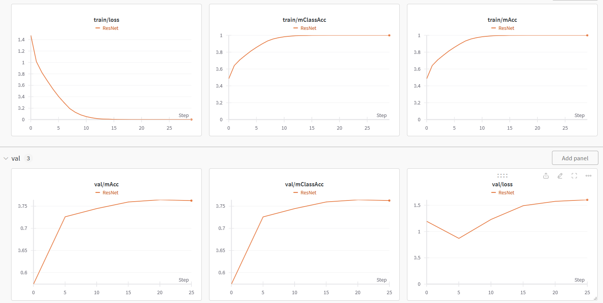

# Deep Learning for Visual Computing - Assignment 1

The first assignment allows you to become familiar with basic pytorch usage and covers deep learning for image classification. In `requirements.txt` you can find a list of packages that have been used for a reference implementation. However, you do not have to use those (except for `torchvision` and `pytorch`). 

This text or the reference code might not be without errors. If you find a significant error (not just typos but errors that affect the assignment), please contact us via [email](mailto:dlvc@cvl.tuwien.ac.at). 

## Part 0 - Overview

Familiarize yourself with the code in the code folder (assignment_1_code) and make sure that the file structure is preserved. Read the code and make sure that you understand what the individual classes and methods are doing. A good starting point might be the `train.py` file, to see what method or class is used for what, and work you way recursively through the classes and functions.

## Part 1 - Dataset

[Download](https://www.cs.toronto.edu/~kriz/cifar.html) and extract the *Python* version of the CIFAR10 dataset somewhere *outside* the code folder. Read the website to understand which classes there are and how the data are structured and read.

Then implement the `CIFAR10Dataset` class (`datasets/cifar10.py`). Some parts of this assignment will be tested automatically so make sure to follow the instructions in the code exactly (note, for example the specified data types). Make sure the following applies. If not, you made a mistake somewhere:

* Number of samples in the individual datasets: 40000 (training), 10000 (validation), 10000 (test).
* Total number of samples: 6000 per class
* Image shape: `(32, 32, 3)`, image type: `uint8` (before applying transforms like v2.ToImage(), v2.ToDtype(torch.float32, scale=True))
* Labels of first 10 training samples: `[6, 9, 9, 4, 1, 1, 2, 7, 8, 3]`
* Make sure that the color channels are in RGB order by displaying the images and verifying the colors are correct (e.g. with `matpltolib.pyplot.imsave`). You can use the file `assignment_1_code/viz.py` for visualization. The first 8 training images are `frog truck truck deer car car bird horse` and should look like this (not normalized): 

Do not modify, add or delete any other files.

## Part 2 - Metrics
Implement the `Accuracy` class (`metrics.py`), which will help us with keeping track of the metrics accuracy and per-class accuracy (*note that in the lecture slides the term `mean class accuracy` is used for per-class accuracy*). Read the doc strings for more detailed instructions and make sure to implement the specified type checks. Note that in general the per-class accuracy is a more "meaningful" metric in case you have an imbalanced dataset. In our case however, since we have a balanced dataset, accuracy and per-class accuracy are going to give the same number.

## Part 3 - Resnet18
As an initial model to work with you will use the resnet18 model provided by Pytorch. To do so follow the 2 steps:

1.  In the file `class_model.py` you can find our wrapper-model `DeepClassifier`, which stores the actual model in `self.net`. Implement the `save` and `load` method which are used for saving the best model during training (in the training loop in `assignment_1_code/trainer.py`) and for testing (in the `test.py` file), where the saved model has to be loaded again. Look at the pytorch documentation for [saving and loading models](https://pytorch.org/tutorials/beginner/saving_loading_models.html#saving-loading-model-for-inference) and how to use `state_dict`.

2. No coding necessary for this: Pytorch, in particular torchvision, comes with a range of [Models](https://pytorch.org/vision/stable/models.html). You should import the resnet18 model (without pretrained weights thus simply `from torchvision.models import resnet18` and `resnet18()` gives you an instance of this model) and use it for one of your experiments (see Part 5).

## Part 4 - Training loop 
Implement the `ImgClassificationTrainer` class (`assignment_1_code/trainer.py`). This class holds the entire training logic. See the doc strings in the class methods for additional information.
1. Implement the method `train` which holds the outer training loop, the loop over the number of epochs. 
    - Keep track of the train and validation loss and metrics using the `Accuracy` class implemented in Part 2 of this exercise, mean accuracy and mean per-class accuracy. You can either use [Weights & Biases](https://wandb.ai/site) (free for academic purposes), tensorboard or store metrics in a list and plot them afterwards.(You will have to include those plots in the report.) Using Weights & Biases is recommended but not mandatory. We provide the file `assignment_1_code/wandb_logger.py`, in case you opt for Weights & Biases. In there you have to change your login key and run information such as entity, project and group. 
    - Save the model if mean per-class accuracy on the validation dataset is higher than the currently saved best mean per-class accuracy (and overwrite that file in the process of training). This way you keep the model that performed best on the validation set for later for testing.
2. Implement the `_train_epoch` and `_val_epoch` methods, that hold the logic for training or validating one epoch. In there you need to loop over the batches in the corresponding dataloaders. Print the results after every epoch, similar to this:
```python
______epoch 0

accuracy: 0.4847
per class accuracy: 0.4848
Accuracy for class: plane is 0.52 
Accuracy for class: car   is 0.58 
Accuracy for class: bird  is 0.32 
Accuracy for class: cat   is 0.32 
Accuracy for class: deer  is 0.39 
Accuracy for class: dog   is 0.42 
Accuracy for class: frog  is 0.59 
Accuracy for class: horse is 0.54 
Accuracy for class: ship  is 0.63 
Accuracy for class: truck is 0.53 
```
Note: make sure your data (and model) are always on the correct device. Make use of `model.eval()`, `model.train()` and `with torch.no_grad()` etc. when appropriate.


## Part 5 - Putting it all together
Now you will put everything into use and run the resnet18 model. 
In the file `train.py` everything is put together and the training is started. In there you specify the model, loss, optimizer, learning rate scheduler, image transformations (given - but can be adapted later, see report part), and hyper-parameters such as number of epochs and batch size. Further, the device used is set up as either CPU or GPU. The training is started with `Trainer(...).train()`. Make sure that your script is runable!

In the file `test.py` you need to implement the testing setup: creating test dataset, test dataloader, test loop (similar to validation loop), loading the trained model etc. 

For reference, using the resnet18 model, the given transforms, a batchsize of 128, validation frequency of 5, 30 epochs, ExponentialLR as lr scheduler with gamma = 0.9, AdamW with amsgrad=True and lr=0.001 as optimizer and CrossEntropyLoss we get the following results on the test set,
```python
test loss: 1.6786944755554198

accuracy: 0.7508
per class accuracy: 0.7508
Accuracy for class: plane is 0.81 
Accuracy for class: car   is 0.86 
Accuracy for class: bird  is 0.69 
Accuracy for class: cat   is 0.55 
Accuracy for class: deer  is 0.73 
Accuracy for class: dog   is 0.61 
Accuracy for class: frog  is 0.82 
Accuracy for class: horse is 0.80 
Accuracy for class: ship  is 0.84 
Accuracy for class: truck is 0.80 
```
and our training and validation curves look like this:



Most likely as you can also see in the plots above you will encounter some overfitting. To address this experiment with different strategies discussed, namely data augmentation and regularization:

* Data augmentation: You are allowed to use torchvision.transforms.v2 functions to apply them on the training set. Have a look at the documentation. Try at least random crops and left/right mirroring. 
* Regularization: use at least weight decay but you can also experiment with dropout (in addition to or instead of weight decay).

In the report you should discuss how the individual techniques affected your training and validation set accuracy and performance on the test set. Compare at least a few combinations and settings like only regularization but no data augmentation vs. both, different regularization strengths and so on. **This may take some time, so don't delay working on the assignment until shortly before the deadline.** Try a couple combinations (at least 3).

To get additional points you experiment with different learning rate schedulers, and optimizers. Discuss your findings in the report.

## Part 6 - Models
Once you have validated that your setup is correct, by being able to run the resnet18 model and getting similar results as the reference results given, it is time to implement your own models.
1. In the file `cnn.py` define a PyTorch CNN with an architecture suitable for Image classification. This can be a simple model with a few layers. (PyTorch (and other libraries) expects the channel dimension of a single sample to be the first one, rows the second one, and columns the third one, `CHW` for short. You should already have this format given the things implemented above.)
2. In the file `vit.py` implement the vision transformer for classification. Here you can use existing repositories or blog posts. The goal is to be able to use existing code and modify it so that it can be integrated with the existing code base. However, you will need to be able to understand what is happening within the code you are using (see report part).

Please note that your own implementation will most likely give worse results than the resnet18 model. This is fine and it is not a goal of the assignment to create new state-of-the-art models but rather to get experience working with Pytorch and handling models as well as training and testing setups.

In total you should run 3 models: Your Pytorch CNN implementation, the resnet18 from `torchvision.models` and your ViT implementation. Put your train and validation metric curves (loss, accuracy and per class accuracy) as figures in the report and submit the best configurations you tried (optimizer, learning rate, lr scheduler, epochs etc. - you might need to use different lr or num epochs per model. However you do not need to do an extensive hyperparameter search, if you see the model is far from its expected capacity, try a different learning rate or more epochs etc. but do not get lost in this; most important part is to be able to run all three and get okayish results.) for each model in separate training files, `train_yourCNN.py`, `train_yourViT.py`, `train_resnet18.py`.

You will also need to create three seperate test files for each model (`test_yourCNN.py`, `test_yourVIT.py`, `test_resnet18.py`) from the `test.py` file.

## Report

Write a short report (3 to 4 pages, not more!) that includes your findings from your experiments and answers the following questions:
* What is the purpose of a loss function? What does the cross-entropy measure? Which criteria must the ground-truth labels and predicted class-scores fulfill to support the cross-entropy loss, and how is this ensured?
* What is the purpose of the training, validation, and test sets and why do we need all of them?
* What are the goals of data augmentation, regularization, and early stopping? How exactly did you use these techniques (hyperparameters, combinations) and what were your results (train, val and test performance)? List all experiments and results, even if they did not work well, and discuss them.
* What are the key differences between ViTs and CNNs? What are the underlying concepts, respectively? Give the source of your ViT model implementation and point to the specific lines of codes (in your code) where the key concept(s) of the ViT are and explain them.

Also include your results obtained from `train.py` and `test.py`. Include the validation and train (per-class) accuracies as a **plot** (ideally all models in one plot per metric to be able to compare between them) as well as the final test (per-class) accuracy. Compare the best validation accuracy and the final test accuracy, and discuss the results. Furthermore, state which optimizer, learning rate scheduler etc. (and their parameteres) were used.

## Submission

Submit your assignment until **May 13th at 11pm**. To do so, create a zip archive including the report, the complete `dlvc` folder with your implementations (do not include the CIFAR-10 dataset), the `test_yourCNN.py`, `test_yourVIT.py`, `test_resnet18.py`  `train_yourCNN.py`, `train_yourViT.py`, `train_resnet18.py` files . More precisely, after extracting the archive we should obtain the following:

    group_x/
        report.pdf
        train_yourCNN.py
        train_yourViT.py
        train_resnet18.py
        test_yourCNN.py
        test_yourVIT.py
        test_resnet18.py
        assignment_1_code/
            metrics.py
            ...


Submit the zip archive on TUWEL. Make sure you've read the general assignment information [here](https://smithers.cvl.tuwien.ac.at/lweijler/dlvc_ss25/-/blob/main/assignments/general.md?ref_type=heads) before your final submission.


## Server Usage

You may find that training is slow on your computer unless you have an Nvidia GPU with CUDA support. If so, copy the code into your home directory on the DLVC server and run it there. The login credentials will be sent out on April 3rd - check your spam folder if you didn't. For details on how to run your scripts see [here](https://smithers.cvl.tuwien.ac.at/lweijler/dlvc_ss25/-/blob/main/assignments/DLVC2025Guide.pdf?ref_type=heads). For technical problems regarding our server please contact [email](mailto:dlvc-trouble@cvl.tuwien.ac.at).

We expect queues will fill up close to assignment deadlines. In this case, you might have to wait a long time before your script even starts. In order to minimize wait times, please do the following:

* Write and test your code locally on your system. If you have a decent Nvidia GPU, please train locally and don't use the servers. If you don't have such a GPU, perform training for a few epochs on the CPU to ensure that your code works. If this is the case, upload your code to our server and do a full training run there. To facilitate this process, have a variable or a runtime argument in your script that controls whether CUDA should be used. Disable this locally and enable it on the server.
* Don't schedule multiple training runs in a single job, and don't submit multiple long jobs. Be fair.
* If you want to train on the server, do so as early as possible. If everyone starts two days before the deadline, there will be long queues and your job might not finish soon enough.
